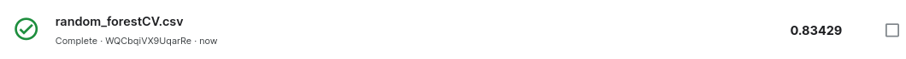

# Importamos
```python
try:
  import google.colab
  IN_COLAB = True
except:
  IN_COLAB = False

import pandas as pd 
import numpy as np
import sklearn as sk
import seaborn as sns
import pydotplus
from six import StringIO
from IPython.display import Image  
from matplotlib import pyplot as plt
from dict_paises import COUNTRY_ALPHA3_TO_COUNTRY_ALPHA2, COUNTRY_ALPHA2_TO_CONTINENT
from joblib import dump, load
from os.path import exists

from sklearn.model_selection import StratifiedKFold, KFold,RandomizedSearchCV, train_test_split, cross_validate
from sklearn.tree import DecisionTreeClassifier, export_graphviz, export_text
from sklearn.metrics import confusion_matrix, classification_report , f1_score, make_scorer, precision_score, recall_score, accuracy_score,f1_score
from sklearn.preprocessing import MinMaxScaler
from sklearn import tree
from sklearn.ensemble import RandomForestClassifier
from sklearn.model_selection import GridSearchCV


#Si estamos  en colab tenemos que instalar la libreria "dtreeviz" aparte. 
if IN_COLAB == True:
    !pip install 'dtreeviz'
import dtreeviz as dtreeviz

#Para eliminar los warnings
import warnings
warnings.simplefilter(action='ignore', category=FutureWarning)
warnings.simplefilter(action='ignore', category=UserWarning)

```

```python
# Constantes
JOBS=-2
SEED=9
```

## Cargamos el dataframe de testeo

```python
hotelsdf_pruebasOriginal = pd.read_csv("./hotels_test.csv")
hotelsdf_pruebas = hotelsdf_pruebasOriginal.copy()
```

# Adaptación de los datos al modelo

Ajustamos los datos encontrados en los datasets de manera conveniente para el analisis posterior con los modelos de ensambles


## Cargamos nuestro dataframe previamente analizado

Vamos a crear una copia de nuestro dataframe

```python
hotelsdf_analizado = pd.read_csv("./dataframeCheckpoint1.csv")
hotelsdf_modelo = hotelsdf_analizado.copy()
print("El data frame esta compuesto por "f"{hotelsdf_modelo.shape[0]}"" filas y "f"{hotelsdf_modelo.shape[1]}"" columnas")
```

Un vistazo básico a la información contenida en el dataframe:

```python
pd.concat([hotelsdf_modelo.head(2), hotelsdf_modelo.sample(5), hotelsdf_modelo.tail(2)])
```

Vemos que tenemos una columa extra "Unnamed: 0". Esta hace referencia la columna de origen del registro. Procedemos a borrarla

```python
hotelsdf_modelo.drop("Unnamed: 0", axis=1, inplace=True)
hotelsdf_modelo.reset_index(drop=True)
print()
```

## Transformacion de las columnas

Para que los datos sean compatibles tomamos todas las columnas correspondientes a las variables cualitativas y procedemos a identificarlas:

```python
valoresAConvertir = hotelsdf_modelo.dtypes[(hotelsdf_modelo.dtypes !='int64') & (hotelsdf_modelo.dtypes !='float64')].index
valoresAConvertir = valoresAConvertir.to_list()
valoresAConvertir
```

Sin embargo, no todas estas columnas nos van a servir para nuestro analisis.

### Booking ID

Vamos a empezar removiendo booking\_id visto en como no la necesitamos para analisis

```python
hotelsdf_modelo.drop("booking_id", axis=1, inplace=True)
hotelsdf_modelo.reset_index(drop=True)
valoresAConvertir.remove('booking_id')
```

### Reservation Status & Reservation status date

Reservation Status nos dice el estado de la reservacion, si fue cancelada o no y reservation status date nos marca la fecha en la que cambio el estado. 
Estas dos columnas nos son redundantes

```python
hotelsdf_modelo.drop("reservation_status", axis=1, inplace=True)
hotelsdf_modelo.reset_index(drop=True)
valoresAConvertir.remove('reservation_status')
```

```python
hotelsdf_modelo.drop("reservation_status_date", axis=1, inplace=True)
hotelsdf_modelo.reset_index(drop=True)
valoresAConvertir.remove('reservation_status_date')
```

### Country

Ajustamos los posibles valores que pueda tomar la variable country haciendo usos de diccionarios externos, con el proposito, de trabajar con el contienente de cada entrada

```python
hotelsdf_modelo["continente"] = hotelsdf_modelo["country"].replace(COUNTRY_ALPHA3_TO_COUNTRY_ALPHA2)
hotelsdf_modelo["continente"] = hotelsdf_modelo["continente"].replace(COUNTRY_ALPHA2_TO_CONTINENT)
```

```python
country = hotelsdf_modelo['country'].unique().tolist()
print(country) 
```

```python
country = hotelsdf_modelo['continente'].unique().tolist()
print(country) 
```

Observando el tratado de los datos identificamos nuevos outliers

"ATA" refiere al **continente** de Antartida. Al ser un valor tan fuera de lo comun y tener una sola ocurrencia decidimos eliminarlo del dataframe

```python
hotelsdf_modelo.drop((hotelsdf_modelo[hotelsdf_modelo["country"] == "ATA"].index.values),inplace=True)
hotelsdf_modelo.reset_index(drop=True)
print()
```

"UMI" hace referenca a unas islas cerca de Hawaii. Al ser un unico caso y tener una poblacion de 300 habitantes, decidimos considerarlo como Estados Unidos, es decir America del Norte

Fuentes:
- https://www.iso.org/obp/ui/#iso:code:3166:UM
- https://en.wikipedia.org/wiki/United_States_Minor_Outlying_Islands

```python
hotelsdf_modelo.loc[hotelsdf_modelo['country'] == "UMI", 'country'] = 'North America'
hotelsdf_modelo.loc[hotelsdf_modelo['continente'] == "UMI", 'continente'] = 'North America'
```

Con estos nuevos cambios, la columna continente toma los siguientes valores

```python
continente = hotelsdf_modelo['continente'].unique().tolist()
print(continente) 
```

Procedemos a dropear la columna de country

```python
hotelsdf_modelo=hotelsdf_modelo.drop(['country'], axis='columns', inplace=False)
valoresAConvertir.remove('country')
valoresAConvertir.append('continente')
hotelsdf_modelo.reset_index(drop=True)
```

```python
valoresAConvertir
```

## One hot encoding

Aplicamos la tecnica de one hot encodig para hacer el dataset compatible con los modelos

```python
hotelsdf_modelo = pd.get_dummies(hotelsdf_modelo, columns=valoresAConvertir, drop_first=True)
```

Vamos a observar como nos quedo el dataframe despues del one hot encoding

```python
hotelsdf_modelo.head()
```

Observamos que hay una **gran** cantidad de columnas


### Ajuste del dataset de pruebas

Tratamos de la misma manera al dataset de pruebas para hacerlo compatible con el modelo

Empezamos cambiando el nombre de las columnas para que coincida con el de nuestro dataframe

```python
nuevas_columnas = {
    'adr':'average_daily_rate',
    'adults':'adult_num',
    'agent':'agent_id',
    'arrival_date_day_of_month':'arrival_month_day',
    'arrival_date_month':'arrival_month',
    'arrival_date_week_number':'arrival_week_number',
    'arrival_date_year':'arrival_year',
    'assigned_room_type':'assigned_room_type',
    'babies':'babies_num',
    'booking_changes':'booking_changes_num',
    'children':'children_num',
    'company':'company_id',
    'country':'country',
    'customer_type':'customer_type',
    'days_in_waiting_list':'days_in_waiting_list',
    'deposit_type':'deposit_type',
    'distribution_channel':'distribution_channel',
    'hotel':'hotel_name',
    'id':'booking_id',
    'is_repeated_guest':'is_repeated_guest',
    'lead_time':'lead_time',
    'market_segment':'market_segment_type',
    'meal':'meal_type',
    'previous_bookings_not_canceled':'previous_bookings_not_canceled_num',
    'previous_cancellations':'previous_cancellations_num',
    'required_car_parking_spaces':'required_car_parking_spaces_num',
    'reserved_room_type':'reserved_room_type',
    'stays_in_weekend_nights':'weekend_nights_num',
    'stays_in_week_nights':'week_nights_num',
    'total_of_special_requests':'special_requests_num',
}

hotelsdf_pruebas.rename(columns = nuevas_columnas, inplace = True)
```

Procesamos datos faltantes

#### Dias Totales

Añadimos la columna agregada en el analisis exploratorio previo

```python
hotelsdf_pruebas["dias_totales"] = hotelsdf_pruebas["week_nights_num"] + hotelsdf_pruebas["weekend_nights_num"]
```

#### Datos faltantes

```python
hotelsdf_pruebas.isnull().sum()
```

```python
print("Vemos que 'company id' tiene un " + str( (hotelsdf_pruebas["company_id"].isnull().sum() * 100) / len(hotelsdf_pruebas)  ) + "% de datos faltantes.")
print("Por esto decidimos eliminar la columna (tanto en el dataset de testeo como en el de entrenamiento)")
```

```python
hotelsdf_pruebas.drop("company_id", axis=1, inplace=True)
hotelsdf_pruebas.reset_index(drop=True)
```

### Valores a convertir

De ser posible aplicamos el cirterio anterior

```python
valores_a_convertir_pruebas = hotelsdf_pruebas.dtypes[(hotelsdf_pruebas.dtypes !='int64') & (hotelsdf_pruebas.dtypes !='float64')].index
valores_a_convertir_pruebas = valores_a_convertir_pruebas.to_list()
valores_a_convertir_pruebas
```

#### Booking ID

```python
hotelsdf_pruebas.drop("booking_id", axis=1, inplace=True)
hotelsdf_pruebas.reset_index(drop=True)
valores_a_convertir_pruebas.remove('booking_id')
```

#### Agent ID

Tomamos el mismo criterio que el checkpoint 1. Transformamos a 0

```python
hotelsdf_pruebas.loc[hotelsdf_pruebas['agent_id'].isnull(), 'agent_id'] = 0
```

#### Reservation Status & Reservation status date

Dropeamos estas columnas debido a que no nos dan ninguna informacion adicional

```python
hotelsdf_pruebas.drop("reservation_status_date", axis=1, inplace=True)
hotelsdf_pruebas.reset_index(drop=True)
valores_a_convertir_pruebas.remove('reservation_status_date')
```

#### Country y Continents

Para los valores faltantes de la columna country aplicamos el criterio del analisis exploratorio y los cambiamos por Portugal

```python
hotelsdf_pruebas.loc[hotelsdf_pruebas['country'].isnull(), 'country'] = 'PRT'
```

```python
hotelsdf_pruebas["continente"] = hotelsdf_pruebas["country"].replace(COUNTRY_ALPHA3_TO_COUNTRY_ALPHA2)
hotelsdf_pruebas["continente"] = hotelsdf_pruebas["continente"].replace(COUNTRY_ALPHA2_TO_CONTINENT)
```

```python
country = hotelsdf_pruebas['country'].unique().tolist()
valores_a_convertir_pruebas.append("continente")
print(country) 
```

```python
continentes = hotelsdf_pruebas['continente'].unique().tolist()
print(continentes) 
```

Tal como ocurrio con el dataset de Train, observamos que hay algunos continente (y por tanto sus paises y registros asociados) que parecen ser outliers.
Los estudiamos

```python
hotelsdf_pruebas[ hotelsdf_pruebas['continente'] =="ATA"]
```

Hay un registro correspondiente a "Antartida". como no podemos dropearlo, le ponemos de continente "north america".\
Le asignamos el valor de America del norte debido a que estados unidos es el pais con mas bases en la antartica

```python
hotelsdf_pruebas.loc[hotelsdf_pruebas['continente'] == "ATA", 'continente'] = "North America"
```

```python
hotelsdf_pruebas[ hotelsdf_pruebas['continente'] =="ATF"]
```

"ATF", que es la sigla de Fr. So. Ant. Tr (French southern and antartic lands).
Ponemos su contienente en Europa. 

```python
hotelsdf_pruebas.loc[hotelsdf_pruebas['continente'] == "ATF", 'continente'] = "Europe"
```

```python
hotelsdf_pruebas[hotelsdf_pruebas['continente'] =="ATF"]
```

#### Analisis de valores faltantes de continente

```python
hotelsdf_pruebas[hotelsdf_pruebas['continente'].isna()]
```

Vemos que hay una serie de registros que no tienen el dato del pais. Sin embargo, no son muchos. Debido a esto, vamos a asignarle estos registros el valor de aquel contiente que tenga la mayor cantidad de registros

```python
sns.countplot(data = hotelsdf_pruebas, x = 'continente', palette= 'Set2')
plt.title('Cantidad de registros por continente')
plt.xlabel('Continente')
plt.ylabel('Cantidad de registros')
```

Vemos que el continente con mayor cantidad de registros es europa, asique lo asignamos a ese valor

```python
hotelsdf_pruebas.loc[hotelsdf_pruebas['continente'].isnull(), 'country'] = 'Europe'
```

Miro q se hayan cambiado bien todos los continentes y no haya valores raros

```python
continentes = hotelsdf_pruebas['continente'].unique().tolist()
print(continentes)
```

Como hicimos con el dataset de train, y ya habiendo procesado la columna continente, dropeamos la columna country

```python
hotelsdf_pruebas=hotelsdf_pruebas.drop(['country'], axis='columns', inplace=False)
hotelsdf_pruebas.reset_index(drop=True)
valores_a_convertir_pruebas.remove('country')
```

#### previous bookings not cancelled

Al igual q en el train, dropeamos esta col

```python
hotelsdf_pruebas=hotelsdf_pruebas.drop(['previous_bookings_not_canceled_num'], axis='columns', inplace=False)
hotelsdf_pruebas.reset_index(drop=True)
```

```python
hotelsdf_pruebas.isnull().sum()
```

### One hot encoding del testeo

De la misma manera al dataset de pruebas aplicamos one hot encoding sobre las columnas de variables cualitativas

```python
hotelsdf_pruebas = pd.get_dummies(hotelsdf_pruebas, columns=valores_a_convertir_pruebas, drop_first=True)
hotelsdf_pruebas.head()
```

### Corroboracion de columnas

Despues de todas estas transformaciones vamos a corrobar que los dataframes tengan la misma cantidad de columnas.

```python
set_test = set(hotelsdf_pruebas.columns)
set_modelo = set(hotelsdf_modelo.columns)

missing = list(sorted(set_test - set_modelo))
added = list(sorted(set_modelo - set_test))

print('Faltan en arbol:', missing)
print('Sobran en arbol:', added)
```

Vemos que en el dataframe del arbol nos sobra la columna "is canceled", cosa que hace sentido ya que esa es la columna con la que vamos a entrenar al dataset. Sin embargo, vemos que tambien hay 3 columnas que faltan en el dataset de arbol. 

Vamos a reasignar los valores de las columnas de test para que coincidan.

El siguiente codigo nos calcula cuantas personas tiene cada tipo de cuarto

```python
cant_cuartos = {}
cant_casos_sumado = 0

cant_cuartos["A"] = 0 #Arrancamos asignado 0 a los cuartos de A. Estos fueron removidos por el one hot. Lo vamos a calcular al final.
for letra in ['A', 'B', 'C', 'D', 'E', 'F', 'G', 'H', 'I', 'J', 'K', 'L', 'M', 'N', 'O', 'P', 'Q', 'R', 'S', 'T', 'U', 'V', 'W', 'X', 'Y', 'Z']:
    tipo_cuarto = 'reserved_room_type_' + letra
    cant_casos_sumado += 1
    if tipo_cuarto not in hotelsdf_pruebas.columns:
        continue
    hotelsdf_pruebas[tipo_cuarto]
    resultado = hotelsdf_pruebas[hotelsdf_pruebas[tipo_cuarto] == 1][tipo_cuarto].sum()
    cant_cuartos[letra] = resultado

cuartosA = len(hotelsdf_pruebas) - cant_casos_sumado
cant_cuartos["A"] = cuartosA


cant_cuartos
```

Vemos que L y P tienen una extremadamente pequena cantidad de apariciones. \
Lo vamos a anadir al roomtype A al ser el que tiene la mayor cantidad de apariciones.

Para anadirlos a la columna a, simplemente tenemos que eliminar las columnas L y P (ya que la columna A es la eliminada por el one hot)

```python
hotelsdf_pruebas.drop("reserved_room_type_L", axis=1, inplace=True)
hotelsdf_pruebas.drop("reserved_room_type_P", axis=1, inplace=True)
hotelsdf_pruebas.reset_index(drop=True)
print()
```

Vamos a aplicar el mismo criterio a assigned room type

```python
cant_cuartos = {}
cant_casos_sumado = 0

cant_cuartos["A"] = 0 #Arrancamos asignado 0 a los cuartos de A. Estos fueron removidos por el one hot. Lo vamos a calcular al final.
for letra in ['A', 'B', 'C', 'D', 'E', 'F', 'G', 'H', 'I', 'J', 'K', 'L', 'M', 'N', 'O', 'P', 'Q', 'R', 'S', 'T', 'U', 'V', 'W', 'X', 'Y', 'Z']:
    tipo_cuarto = 'assigned_room_type_' + letra
    cant_casos_sumado += 1
    if tipo_cuarto not in hotelsdf_pruebas.columns:
        continue
    hotelsdf_pruebas[tipo_cuarto]
    resultado = hotelsdf_pruebas[hotelsdf_pruebas[tipo_cuarto] == 1][tipo_cuarto].sum()
    cant_cuartos[letra] = resultado

cuartosA = len(hotelsdf_pruebas) - cant_casos_sumado
cant_cuartos["A"] = cuartosA


cant_cuartos
```

Aca tambien vemos que P tiene muy pocas aparciones. Asique aplicamos el mismo criterio de antes

```python
hotelsdf_pruebas.drop("assigned_room_type_P", axis=1, inplace=True)
hotelsdf_pruebas.reset_index(drop=True)
print()
```

Vemos ahora que nuestras columnas coinciden

```python
set_test = set(hotelsdf_pruebas.columns)
set_modelo = set(hotelsdf_modelo.columns)

missing = list(sorted(set_test - set_modelo))
added = list(sorted(set_modelo - set_test))

print('Faltan en arbol:', missing)
print('Sobran en arbol:', added)
```

# Generacion de datos para el entrenamiento de los modelos

Se genera un dataset con los datos necesarios para predecir la cancelacion y creamos un dataset conteniendo el target, para luego, generar conjuntos de test y train

```python
hotelsdf_modelo_x=hotelsdf_modelo.drop(['is_canceled'], axis='columns', inplace=False)

hotelsdf_modelo_y = hotelsdf_modelo['is_canceled'].copy()

x_train, x_test, y_train, y_test = train_test_split(hotelsdf_modelo_x,
                                                    hotelsdf_modelo_y, 
                                                    test_size=0.3,  #proporcion 70/30
                                                    random_state=SEED) #Semilla 9, como el Equipo !!
```

# KNN

Entrenamos un primer modelo de KNN usando los datos previamente tratados

## KNN sin busqueda de hiperparametros

En primera instancia entrenamos un modelo sin optimizar hiperparametros 

```python
#from sklearn.neighbors import KNeighborsClassifier

#knn_base = KNeighborsClassifier()
#knn_base.get_params()

#knn_base.fit(x_train, y_train)
#y_pred = knn_base.predict(x_test)
```

```python
#print('correctas: ', np.sum(y_test == y_pred))
#print('total: ', len(y_test))
```

```python
#accuracy_score(y_test,y_pred)
```

```python
#y_pred = knn_base.predict(hotelsdf_pruebas)
#y_pred
#df_submission = pd.DataFrame({'id': hotelsdf_pruebasOriginal['id'], 'is_canceled': y_pred})
#df_submission.to_csv('knn_base.csv', index=False)
#dump(knn_base, 'knn_base.joblib')
```

# SVM 


# Random Forest 


Para empezar con el random forest, vamos a crear un modelo con valores totalmente aleatorios.
Usando https://www.random.org/, con valor maximo 50 y valor minimo 1, obtuvimos:
- 33
- 15
- 40
- 36

(Criterion fue dejado como entropy)

```python
#Creamos un clasificador con hiperparámetros arbitrarios
rfc = RandomForestClassifier(max_features='auto', 
                             n_jobs=JOBS,
                             criterion="entropy", 
                             random_state=SEED, 
                             min_samples_leaf=15,
                             min_samples_split=40,
                             n_estimators=36 )
#Entrenamos el modelo
model = rfc.fit(X = x_train, y = y_train)
```

```python
#Nos guardamos este modelo para poder cargarlo en todas las corridas posteriores
#dump(model, 'modelos/randomForest.joblib')
model = load('modelos/randomForest.joblib')
```

```python
#Realizamos una predicción sobre el set de test
y_pred = model.predict(x_test)
#Valores Predichos
y_pred
```

La matriz de confusion es la siguiente:

```python
#Creamos la matriz de confusión
tabla=confusion_matrix(y_test, y_pred)

#Grafico la matriz de confusión
sns.heatmap(tabla,cmap='GnBu',annot=True,fmt='g')
plt.xlabel('Predicted')
plt.ylabel('True')
```

Vemos que obtuvimos una alta cantidad de falsos positivos


Sin ningun tipo de optimizacion obtuvimos los siguientes scores 

```python
accuracy=accuracy_score(y_test,y_pred)
recall=recall_score(y_test,y_pred)
f1=f1_score(y_test,y_pred)

print("Accuracy: "+str(accuracy))
print("Recall: "+str(recall))
print("f1 score: "+str(f1))
```

Ademas, segun este modelo; las 10 columnas mas relevantes son:

```python
p = sorted(list(zip(hotelsdf_modelo_x.columns.to_list(), model.feature_importances_)), key=lambda x: -x[1])
for i in range(10):
    print(p[i])
```

## Cross validation


Ahora vamos a buscar mejorar esos resultados; optimizando los hiperparametros usando validacion cruzada

```python
if exists('modelos/randomForestCV.joblib') == False:
    rf_cv = RandomForestClassifier(oob_score=False, random_state=9, n_jobs=JOBS)
    #rf_cv = RandomForestClassifier(max_features='sqrt', oob_score=True, random_state=1, n_jobs=-1)
    param_grid = { "criterion" : ["gini", "entropy"], 
                   "min_samples_leaf" : [1, 5, 10, 15, 20], #Vamos a hacer muchas combinaciones ya que solo vamos
                   "min_samples_split" : [2, 8, 16, 32, 64],#a correr este modelo 1 sola vez; ya que lo vamos a 
                   "n_estimators": [10, 20, 30, 40, 50, 60, 70] } #guardar   

    #Probamos entrenando sólo con 1 métrica
    gs = GridSearchCV(estimator=rf_cv, param_grid=param_grid, scoring="f1", cv=5, n_jobs=JOBS) #Optimizamos f1_score
    gs_fit = gs.fit(X = x_train, y = y_train)
    dump(gs_fit, 'modelos/randomForestCV.joblib')
```

```python
gs_fit = load('modelos/randomForestCV.joblib')
```

```python
gs_fit.best_params_
```

```python
#Obtenemos el mejor modelo
rf_cv_best=gs_fit.best_estimator_

#Predicción
y_pred_rf_cv_best = rf_cv_best.predict(x_test)
y_pred_rf_cv_best
```

Con esta validacion, obtenemos la siguiente matriz de confusion

```python
#Creo matriz de confusión
tabla=confusion_matrix(y_test,y_pred_rf_cv_best)

#Grafico matriz de confusión
sns.heatmap(tabla, cmap='Blues',annot=True,fmt='g')
plt.xlabel('Predicted')
plt.ylabel('True')

#Reporte
print(classification_report(y_test,y_pred_rf_cv_best))
```

A priori, se ven menos falsos positivos

```python
#Evaluo la performance en el conjunto de evaluación
accuracyCV=accuracy_score(y_test,y_pred_rf_cv_best)
recallCV=recall_score(y_test,y_pred_rf_cv_best)
f1CV=f1_score(y_test,y_pred_rf_cv_best)

print("Accuracy: "+str(accuracyCV))
print("Recall: "+str(recallCV))
print("f1 score: "+str(f1CV))
```

Con este nuevo modelo, obtuvimos las siguientes mejoras:

```python
print(str("Accuracy = ") + str(accuracyCV - accuracy)[3:4] + "%")
print(str("Recall = ") + str(recallCV - recall)[3:4] + "%")
print(str("f1 score = ") + str(f1CV - f1)[3:4] + "%")
```

Vemos que optimizando por el f1 score, obtuvimos una mejora del 2% nada mas; pero una mejora del 4% en recall


Vamos a realizar una submission de este modelo


Este modelo tuvo el siguiente resultado en Kaggle



## Cross validation multiples metricas


Ahora vamos a realizar un random forest pero tratando de optimizar distintas metricas a la vez. \
Luego vamos a elegir la que optimice mejor todas las metricas

```python
if exists('modelos/randomForestCVMM.joblib') == False:
    rf_cv = RandomForestClassifier(oob_score=False, random_state=1, n_jobs=JOBS)

    param_grid = { "criterion" : ["gini", "entropy"], 
                    "min_samples_leaf" : [1, 5, 10, 15, 20], #Vamos a hacer muchas combinaciones ya que solo vamos
                    "min_samples_split" : [2, 8, 16, 32, 64],#a correr este modelo 1 sola vez; ya que lo vamos a 
                    "n_estimators": [10, 20, 30, 40, 50, 60, 70] } #guardar   


    #Probamos entrenando con varias métricas

    metricas=['accuracy','f1','roc_auc' ,'recall', 'precision'] #'recall','precision'

    gs_multimetrica = GridSearchCV(estimator=rf_cv, 
                                   param_grid=param_grid, 
                                   scoring=metricas, 
                                   refit=False, 
                                   cv=5, 
                                   n_jobs=JOBS)
    #Entrenamiento
    gs_multimetrica_fit = gs_multimetrica.fit(X = x_train, y = y_train)
    dump(gs_multimetrica_fit, 'modelos/randomForestCVMM.joblib')

```

```python
gs_multimetrica_fit = load('modelos/randomForestCVMM.joblib')
```

Vamos a graficar todos los resultados de las metricas que medimos

```python
labels=[ key for key in gs_multimetrica_fit.cv_results_.keys() if("mean_test" in key)]

for k in labels:
    plt.plot(gs_multimetrica_fit.cv_results_[k],linestyle='--' , linewidth=0.8,marker='o',markersize=2)     
    x_linea=np.argmax(gs_multimetrica_fit.cv_results_[k])
    plt.axvline(x_linea,linestyle='--' ,linewidth=0.8,color='grey')
        
plt.xlabel("modelo", fontsize=10)
plt.ylabel("métrica", fontsize=10)
plt.legend(labels)
plt.show()
```

Del grafico se observa que hay un modelo que parece optimizar todas las metricas. A ojo parece ser el ~180\
Vamos a corroborarlo:

```python
for metrica in metricas:
    params_analizar=gs_multimetrica_fit.cv_results_['params'][np.argmax(gs_multimetrica_fit.cv_results_['mean_test_' + metrica])]
    print(
"Metrica " + metrica + ": " + str(params_analizar))
```

Vemos que son todos muy similares pero con cierta variazon. Vamos a elegir a f1 score para tener cierto tipo de balance

```python
params_analizar=gs_multimetrica_fit.cv_results_['params'][np.argmax(gs_multimetrica_fit.cv_results_['mean_test_f1'])]

#Creamos un clasificador RF
rfc_multimetrica = RandomForestClassifier(criterion= params_elegidos['criterion'], 
                                          min_samples_leaf= params_elegidos['min_samples_leaf'], 
                                          min_samples_split= params_elegidos['min_samples_split'], 
                                          n_estimators=params_elegidos['n_estimators'], 
                                          oob_score=True, random_state=2, n_jobs=JOBS)
#Entrenamos un modelo
model_rfc_multimetrica = rfc_multimetrica.fit(X = x_train, y = y_train)

#Hacemos una predicción con el dataset de train
y_pred_model_rfc_multimetrica = model_rfc_multimetrica.predict(x_test)
```

Vamos a visualizar uno de los estimadores de este random forest resultante:

```python
plt.figure(figsize=(12,12))

tree_plot=tree.plot_tree(rfc_multimetrica.estimators_[56],
                         max_depth=2,
                         feature_names=hotelsdf_modelo_x.columns.to_list(),
                         filled=True,
                         rounded=True,
                         class_names=True)

plt.show(tree_plot)
```

Vision completa:

```python
plt.figure(figsize=(100,100))

tree_plot_completo=tree.plot_tree(rfc_multimetrica.estimators_[56],
                                 feature_names=hotelsdf_modelo_x.columns.to_list(),
                                 filled=True,
                                 rounded=True,)
                                 #class_names=['Not Survived','Survived']) #model.classes_
plt.show(tree_plot_completo)
```

Calculamos la matriz de confusion

```python
#Matriz de Confusión
cm = confusion_matrix(y_test,y_pred_model_rfc_multimetrica)
sns.heatmap(cm, cmap='Blues',annot=True,fmt='g')
plt.xlabel('Predicted')
plt.ylabel('True')

#Reporte
print(classification_report(y_test,y_pred_model_rfc_multimetrica))

```

A pesar de todas nuestra busqueda, no se observan cambios significativos

```python
#Evaluo la performance en el conjunto de evaluación
accuracyCVMM=accuracy_score(y_test,y_pred_model_rfc_multimetrica)
recallCVMM=recall_score(y_test,y_pred_model_rfc_multimetrica)
f1CVMM=f1_score(y_test,y_pred_model_rfc_multimetrica)

print("Accuracy: "+str(accuracyCVMM))
print("Recall: "+str(recallCVMM))
print("f1 score: "+str(f1CVMM))
```

Sorprendentemente, no tuvimos mejoras significativas comparado con el modelo que no consideraba todas las metricas

```python
print(str("Accuracy = ") + str(accuracyCVMM - accuracyCV)[3:4] + "%")
print(str("Recall = ") + str(recallCVMM - recallCV)[3:4] + "%")
print(str("f1 score = ") + str(f1CVMM - f1CV)[3:4] + "%")
```

Realizamos la prediccion sobre el dataset de testeo

```python
y_pred_model_rfc_multimetrica = model_rfc_multimetrica.predict(hotelsdf_pruebas)
```

```python
df_submission = pd.DataFrame({'id': hotelsdf_pruebasOriginal['id'], 'is_canceled': y_pred_model_rfc_multimetrica})
df_submission.head()
```

```python
df_submission.to_csv('submissions/random_forestCVMM.csv', index=False)
```

Este modelo tuvo el siguiente resultado en Kaggle


Vemos que a pesar de todas nuestras mejoras, solo obtuvimos una mejora del 0.2%


# XGBoost 


# Modelo Voting


# Modelo Stacking 


# Conclusiones 
